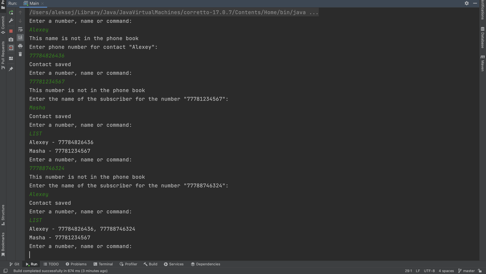

# PhoneBook

The program works like a phone book:

* If we enter a new name, the program asks for a phone number and remembers it.
* If the new phone number - asks for a name and also remembers.
* If we enter an existing name or phone number, the program displays the phone(s) or the name of the subscriber, respectively.
* При вводе команды LIST программа печатает в консоль список всех абонентов в алфавитном порядке с номерами.

